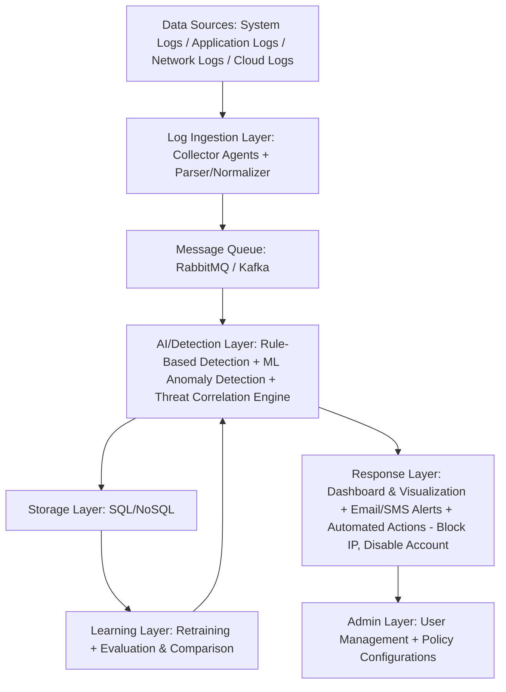

# 🔥 FLARE – Federated Learning for Anomaly Recognition & Explainability  
**by IU - Beaconers**  

FLARE is a next-generation **AI-driven cybersecurity platform** designed to detect, explain, and respond to threats in real time — while preserving data privacy through **Federated Learning**.

  
  

---

## 🎥 Project Demonstration Video

Watch our full project explanation and demonstration here:  
▶️ [**FLARE Project Video (YouTube)**](https://youtu.be/iII7gCDTWcQ?si=i2nLJWpmDu9TfDLP)

---
## 🌐 **Live Dashboard:**  
Watch our live project dashboard and visualization here:

[**FLARE Dashboard (Vercel)**](https://flare-lemon.vercel.app/)  

---

## 🧩 Overview
In today’s cyber landscape, Pakistan’s critical infrastructures such as **banking, telecom, healthcare, and defense** face constant threats.  
Existing tools like Splunk are expensive, centralized, and compromise privacy.

**FLARE** bridges that gap — offering a **lightweight, cost-effective, and explainable SIEM alternative** that keeps data *local* and intelligence *shared*.

---

## 🚀 Key Features

### 🧠 **1. Hybrid Detection Engine**
- **Rule-Based Detection**: Catches known attack patterns (e.g., failed logins, port scans).  
- **ML-Based Detection**: Detects novel anomalies using LSTM and Autoencoders.

### 🔒 **2. Federated Learning**
- Local models train on organization-specific logs.
- Only model weights (not raw data) are shared — ensuring privacy and sovereignty.

### 💡 **3. Explainable AI**
- Every alert comes with a reason:
  > “Unusual login at 3 AM from a new location contributed 78% to anomaly score.”

### 🧑‍💻 **4. Human-in-the-Loop Automation**
- FLARE can **auto-suggest** actions like “Block IP” or “Disable Account,”  
  but analysts make the final decision.

### 🌐 **5. Unified Dashboard**
- Real-time threat visualization  
- Event timelines and severity graphs  
- Endpoint and data ingestion monitoring  
---

## 📚 Datasets Used

Our model and simulations are trained and tested using **real-world, research-grade datasets** that closely mimic enterprise-scale cyber environments.

### 🧩 1. CICIDS2017 – Intrusion Detection Dataset  
**Source:** [Canadian Institute for Cybersecurity (CIC), University of New Brunswick](https://www.kaggle.com/datasets/ericanacletoribeiro/cicids2017-cleaned-and-preprocessed)  
**Size:** ~1.8 GB (cleaned and preprocessed version)  
**Type:** Network & System Logs  
**Description:**  
CICIDS2017 is one of the most widely recognized datasets in the cybersecurity research community. It contains both **normal traffic and various modern attack patterns** such as DDoS, brute force, port scanning, infiltration, and web attacks.  
Each record includes over **80 features** capturing detailed flow statistics, timestamps, and labels ideal for **ML-based anomaly detection**.  

**Why FLARE uses it:**  
Used to train and benchmark our **Network Log** and **System Log** anomaly detection module, forming the base for the hybrid detection model (Rule-Based + ML).

---

### 🛡️ 2. SOC BOTS v3 – Splunk Attack Simulation Dataset  
**Source:** [Splunk Security Research, Boss of the SOC v3](https://www.splunk.com/en_us/blog/security/botsv3-dataset-released.html)  
**Size:** ~1.2 GB (Splunk SIEM export files)  
**Type:** Application & Cloud Logs  
**Description:**  
SOC BOTS v3 is a **simulated enterprise SOC dataset** built by Splunk’s security team to train analysts in detecting real-world adversarial behaviors.  
It contains **Windows Event Logs, Sysmon data, proxy traffic, PowerShell executions, and Azure AD logs**, all mapped to **MITRE ATT&CK tactics**.  
The dataset mimics a realistic enterprise compromise including lateral movement, persistence, and exfiltration activities.

**Why FLARE uses it:**  
Used for **Application Log** and **Cloud Log** modules helps validate our explainable detection system on enterprise-grade log sources and federated learning experiments.

---

### 🔍 Why These Datasets?
| Dataset | Type | Authenticity | Usage in FLARE |
|----------|------|---------------|----------------|
| **CICIDS2017** | Network/System | Research-grade (CIC-UNB) | Train anomaly detection model |
| **SOC BOTS v3** | Application/Cloud | Enterprise-grade (Splunk) | Evaluate hybrid detection & explainability |

Both datasets are **publicly available, peer-recognized, and widely cited** in AI-driven intrusion detection research ensuring **replicability, authenticity, and academic value** for our project.

---

## 🏗️ System Architecture

🏁 License
© 2025 IU - Beaconers
This module is part of the FLARE Project (Federated Learning for Anomaly Recognition & Explainability).
All operations are local and compliant with data privacy standards.