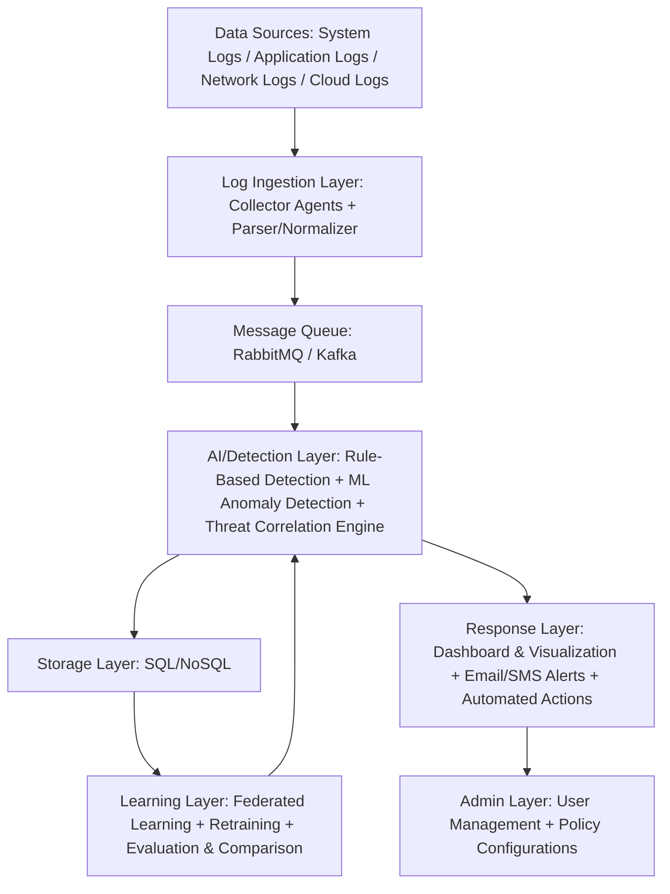

# 🔥 FLARE – Federated Learning for Anomaly Recognition & Explainability  
**by IU - Beaconers**  

FLARE is a next-generation **AI-driven cybersecurity platform** designed to detect, explain, and respond to threats in real time – while preserving data privacy through **Federated Learning**.

**The Intelligent Shield for Pakistan's SMEs** 🛡️
*Empowering Your Digital Future*

  
  

---

## 🎥 Project Demonstration Video

Watch our full project explanation and demonstration here:  
▶️ [**FLARE Project Video (YouTube)**](https://youtu.be/iII7gCDTWcQ?si=i2nLJWpmDu9TfDLP)

---

## 🌐 Live Dashboard

Watch our live project dashboard and visualization here:

[**FLARE Dashboard (Vercel)**](https://flare-lemon.vercel.app/)  

---

## 📋 Table of Contents
- [Overview](#-overview)
- [Problem Statement](#-problem-statement)
- [Our Mission](#-our-mission)
- [Key Features](#-key-features)
- [What Can It Do?](#-what-can-it-do)
- [Why FLARE?](#-why-flare)
- [System Architecture](#️-system-architecture)
- [Technical Goals and Objectives](#-technical-goals-and-objectives)
- [Project Scope](#-project-scope)
- [Datasets](#-datasets)
- [Technology Stack](#-technology-stack)
- [Development Methodology](#-development-methodology)
- [Team](#-team)
- [Project Timeline](#-project-timeline)
- [Learning Outcomes](#-learning-outcomes)
- [Sustainable Development Goals Mapping](#-sustainable-development-goals-mapping)
- [License](#-license)

---

## 🧩 Overview

In today's cyber landscape, Pakistan's critical infrastructures such as **banking, telecom, healthcare, and defense** face constant threats. With a **151% surge in cyberattacks between 2020–2024** [PTA Annual Report - 2024], small and medium enterprises (SMEs) are particularly vulnerable.

Existing tools like Splunk are expensive, centralized, and incompatible with local data sovereignty policies, leaving organizations isolated and vulnerable to delayed threat detection and high false positives.

**FLARE** bridges that gap – offering a **lightweight, cost-effective, and explainable SIEM alternative** that keeps data *local* and intelligence *shared*.

---

## 🎯 Problem Statement

Pakistan has witnessed a 151% surge in cyberattacks between 2020–2024, targeting critical sectors like finance and government. Existing SIEM tools are expensive, centralized, and incompatible with local data sovereignty policies, leaving organizations isolated and vulnerable to delayed threat detection and high false positives. Small businesses can no longer rely on basic antivirus protection – they need enterprise-grade security that respects privacy and is financially accessible.

---

## 🚀 Our Mission

We believe enterprise-grade security shouldn't be a luxury. Our mission is to democratize advanced protection by providing an affordable, intelligent, and sovereign SIEM that respects your privacy. FLARE empowers Pakistani SMEs with the same defensive capabilities as large corporations – without the million-dollar price tag or dependency on foreign cloud infrastructure.

---

## 🔑 Key Features

### 🧠 **1. AI-Driven Shield**
Real-time threat blocking with Human-in-the-Loop oversight. FLARE combines automated detection with human judgment to prevent false positives and business disruption.

### 🔒 **2. Absolute Privacy**
Your logs never leave your perimeter – guaranteed Data Sovereignty. Unlike cloud-based SIEMs, FLARE ensures sensitive private files remain locked securely inside your own walls, 24/7.

### 🛡️ **3. Hardened Security**
Military-grade encryption using **TLS 1.3** and **RSA-2048** for all data in transit and at rest. Your security infrastructure is protected by the same standards used by defense organizations.

### 🎯 **4. Proactive Hunting**
Intelligent tracking across the entire Cyber Kill Chain – from reconnaissance to exfiltration. FLARE monitors every stage of potential attacks.

### ⚡ **5. High-Speed Core**
Instant log normalization using high-performance **Protobuf**. Process thousands of events per second without performance degradation.

### 🚨 **6. Theft Prevention**
Integrated defenses against **Brute Force** attacks and **Data Exfiltration** attempts. Automatically detect and block unauthorized access patterns.

### 📊 **7. Live Visibility**
A high-speed **360° dashboard** for instant security insights. Monitor your entire security posture in real-time with intuitive visualizations.

### 🧠 **8. Hybrid Detection Engine**
- **Rule-Based Detection**: Catches known attack patterns (e.g., failed logins, port scans, SQL injection).  
- **ML-Based Detection**: Detects novel anomalies using **LSTM** and **Autoencoders** for behavioral analysis.

### 🔗 **9. Federated Learning**
- Local models train on organization-specific logs
- Only model weights (not raw data) are shared – ensuring privacy and sovereignty
- Collective defense: sharing threat lessons while keeping your private trade secrets

### 💡 **10. Explainable AI**
Every alert comes with a clear reason:
> "Unusual login at 3 AM from a new location contributed 78% to anomaly score."

Transparency in threat detection helps analysts understand and respond effectively.

### 🧑‍💻 **11. Human-in-the-Loop Automation (HITL Response)**
- FLARE can **auto-suggest** actions like "Block IP" or "Disable Account"
- Analysts make the final decision to prevent accidental disruption
- Real-time neutralization with human oversight

### 🌐 **12. Unified Dashboard**
- Real-time threat visualization and severity graphs
- Event timelines and forensic search capabilities
- Endpoint and data ingestion monitoring
- Admin panel with user management and policy configurations

---

## 💼 What Can It Do?

### 🕵️ **Smart Detection**
FLARE learns your business's "normal" behavior and instantly spots suspicious activity, like a midnight login attempt. The system understands context – not just rules.

### 🏠 **Local Protection**
FLARE watches your data 24/7, keeping sensitive private files locked securely inside your own walls. Your data sovereignty is guaranteed.

### 🤝 **Community Intelligence**
Your system shares "threat lessons" with other businesses in the network—never your private data. When one organization is threatened, everyone is protected instantly through federated learning.

---

## ❓ Why FLARE?

### 🧩 **Smarter Together**
Federated Learning provides collective defense, sharing threat lessons while keeping your private trade secrets safe. Decentralization removes single points of failure.

### 🏗️ **Resilient Design**
Decentralization removes single points of failure, ensuring your security never depends on a vulnerable central server. Each node operates independently while contributing to collective intelligence.

### 💰 **Cost-Efficient Defense**
Low-resource AI eliminates million-dollar hardware and expensive enterprise licenses for Pakistani SMEs. FLARE delivers enterprise capabilities at SME prices.

### 🔐 **Privacy-First Architecture**
Unlike traditional SIEMs that require cloud uploads, FLARE ensures your raw logs never leave your local perimeter. Complete data sovereignty guaranteed.

---

## 🗝️ System Architecture

### Architecture Components

#### **Client Side**
- **Client Node**: Local ML training and log fetching
- **Log Fetcher**: Collects logs from various sources
- **Buffer & CIM**: Common Information Model for log normalization

#### **Central Aggregator**
- **Global Model**: Aggregates federated learning updates
- **Secure Connectivity**: TLS 1.3 encrypted communication

#### **Real-Time Processing**
- **Admin Panel**: Configuration and user management
- **Live Dashboard**: Real-time threat visualization
- **Alert System**: Email alerts and persistent database audit logging

#### **Security Features**
- **SHA-256 Hashing**: Secure data integrity
- **RSA-2048 Signatures**: Authentication over TLS 1.3 channels
- **High-Speed Protobuf**: Efficient log normalization into UnifiedLog CIM

---

## 🎯 Technical Goals and Objectives

### **Detection Objective**
Achieve **>85% accuracy** via a hybrid Rule + ML pipeline combining signature-based detection with behavioral anomaly analysis.

### **Response Objective**
Provide real-time alerts with HITL (Human-in-the-Loop) oversight, enabling analysts to approve or reject automated response actions.

### **Sovereignty Objective**
Federated Learning ensures raw logs stay within local perimeters while sharing only model updates for collective threat intelligence.

### **Performance Promise**
- Detection: >85% accuracy via Rule + ML intelligence
- Privacy: Zero-exposure AI training through Federated Learning
- Response: Real-time neutralization with Human-in-the-Loop oversight

---

## 📦 Project Scope

### **Included:**
- Log ingestion, normalization, and indexing
- Rule-based and ML-based anomaly detection
- Federated learning for collaborative model training
- Dashboard for visualization and alerting
- Human-in-the-loop response automation
- HITL Response mechanisms
- Advanced Threat Hunting capabilities
- RDP Anomaly Detection
- Real-Time Visualization
- Data Sovereignty controls
- High-Speed Normalization using Protobuf
- Secure Sync Layer with TLS 1.3
- Dynamic IP Connectivity
- Brute Force Defense
- Exfiltration Tracking
- Privacy-Preserving AI

### **Excluded:**
- Full-scale enterprise deployment across multiple geographic regions
- Real-time integration with external cloud SIEMs (Splunk, Sentinel)
- Custom hardware sensors or proprietary data feeds
- Penetration testing services
- 24/7 managed SOC services

---

## 📚 Datasets

Our model and simulations are trained and tested using **real-world, research-grade datasets** that closely mimic enterprise-scale cyber environments.

### 🧩 1. CICIDS2017 – Intrusion Detection Dataset  
**Source:** [Canadian Institute for Cybersecurity (CIC), University of New Brunswick](https://www.kaggle.com/datasets/ericanacletoribeiro/cicids2017-cleaned-and-preprocessed)  
**Size:** ~1.8 GB (cleaned and preprocessed version)  
**Type:** Network & System Logs  

**Description:**  
CICIDS2017 is one of the most widely recognized datasets in the cybersecurity research community. It contains both **normal traffic and various modern attack patterns** such as DDoS, brute force, port scanning, infiltration, and web attacks. Each record includes over **80 features** capturing detailed flow statistics, timestamps, and labels ideal for **ML-based anomaly detection**.  

**Why FLARE uses it:**  
Used to train and benchmark our **Network Log** and **System Log** anomaly detection module, forming the base for the hybrid detection model (Rule-Based + ML).

---

### 🛡️ 2. SOC BOTS v3 – Splunk Attack Simulation Dataset  
**Source:** [Splunk Security Research, Boss of the SOC v3](https://www.splunk.com/en_us/blog/security/botsv3-dataset-released.html)  
**Size:** ~1.2 GB (Splunk SIEM export files)  
**Type:** Application & Cloud Logs  

**Description:**  
SOC BOTS v3 is a **simulated enterprise SOC dataset** built by Splunk's security team to train analysts in detecting real-world adversarial behaviors. It contains **Windows Event Logs, Sysmon data, proxy traffic, PowerShell executions, and Azure AD logs**, all mapped to **MITRE ATT&CK tactics**. The dataset mimics a realistic enterprise compromise including lateral movement, persistence, and exfiltration activities.

**Why FLARE uses it:**  
Used for **Application Log** and **Cloud Log** modules to validate our explainable detection system on enterprise-grade log sources and federated learning experiments.

---

### 🔍 Why These Datasets?

| Dataset | Type | Authenticity | Usage in FLARE |
|----------|------|---------------|----------------|
| **CICIDS2017** | Network/System | Research-grade (CIC-UNB) | Train anomaly detection model |
| **SOC BOTS v3** | Application/Cloud | Enterprise-grade (Splunk) | Evaluate hybrid detection & explainability |

Both datasets are **publicly available, peer-recognized, and widely cited** in AI-driven intrusion detection research, ensuring **replicability, authenticity, and academic value** for our project.

---

## 🛠️ Technology Stack

### **Programming Languages**
- Python (Backend ML/AI, data processing)
- JavaScript (Frontend dashboard)

### **Frameworks & Libraries**
- **Backend**: Flask, PyTorch, TensorFlow Federated
- **Frontend**: Streamlit
- **Data Processing**: Pandas, NumPy, Matplotlib, Protobuf
- **Machine Learning**: LSTM, Autoencoders, Federated Learning

### **Databases**
- MongoDB / SQLite (flexible NoSQL and SQL storage)

### **Infrastructure & Tools**
- **Workflow Orchestration**: Apache Airflow
- **Message Queue**: Kafka, RabbitMQ
- **Containerization**: Docker
- **External APIs**: Email/SMS alerting, SOAR automation
- **Security**: TLS 1.3, RSA-2048, SHA-256 hashing

### **Deployment**
- Vercel (Dashboard hosting)

---

## 🔄 Development Methodology

The project follows the **Agile Model** to enable iterative development with continuous feedback and improvement:

1. **Literature Review & Dataset Collection**: Understanding existing research and gathering relevant cybersecurity datasets (CICIDS2017, SOC BOTS v3)

2. **Log Ingestion & Rule Engine Development**: Collecting and processing security logs for rule-based threat detection

3. **Machine Learning Model Training**: Using federated autoencoders and LSTM to detect anomalies while preserving data privacy

4. **Integration of Detection Engines & Dashboard**: Real-time monitoring, alerting, and visualization for security analysts

5. **Testing & Performance Evaluation**: Validating detection accuracy, system responsiveness, and overall effectiveness

---

## 👥 Team

### **Team Members**
| Name | Registration No. | CGPA | Role |
|------|------------------|------|------|
| Abdul Sarim Khan | 62527 | 3.91 | Team Lead |
| Rehan Naseer | 61930 | 3.17 | Developer |
| Muhammad Farhan Khalid | 63225 | 3.10 | Developer |

### **Supervisors**
- **Dr. Jawad Hussain Awan** – Head, Cyber Security Program, Iqra University
- **Prof. Dr. Mansoor Ebrahim** – Associate Dean, FEST, Iqra University

### **Institution**
**Iqra University** – Department of Computer Science, Batch Fall 2022

---

## 📅 Project Timeline

| Phase | Task | Duration | Dependencies | Start Date | End Date |
|-------|------|----------|--------------|------------|----------|
| 1 | Planning & Research | 3 weeks | None | 10/20/2025 | 11/9/2025 |
| 2 | Environment Setup | 2 weeks | Phase 1 | 11/10/2025 | 11/23/2025 |
| 3 | Log Ingestion Layer | 5 weeks | Phase 2 | 11/24/2025 | 12/28/2025 |
| 4 | Message Queue Layer | 5 weeks | Phase 2 (parallel) | 11/24/2025 | 12/28/2025 |
| 5 | Storage Layer | 2 weeks | Phase 4 | 12/29/2025 | 1/11/2026 |
| 6 | AI/Detection Layer | 3 weeks | Phase 4 | 1/12/2026 | 2/1/2026 |
| 7 | Learning Layer | 5 weeks | Phase 4 | 1/12/2026 | 2/15/2026 |
| 8 | Response & Alert Layer | 3 weeks | Phases 4, 7 | 2/16/2026 | 3/8/2026 |
| 9 | Admin/Control Layer | 2 weeks | Phase 8 | 3/9/2026 | 3/22/2026 |
| 10 | Integration & Testing | 5 weeks | Phase 7 (parallel) | 2/16/2026 | 3/22/2026 |
| 11 | Documentation & Report | 2 weeks | All phases | 3/23/2026 | 4/5/2026 |
| 12 | Polishing Documentation | 2 weeks | Phase 11 | 4/6/2026 | 4/19/2026 |

---

## 🎓 Learning Outcomes

- Hands-on experience in **federated learning** and **anomaly detection**
- Understanding of **SIEM architecture** and **log analytics**
- Skills in **full-stack development** and **secure system design**
- Exposure to **explainable AI** and **cybersecurity automation**
- Experience with **distributed systems** and **privacy-preserving technologies**

---

## 🌍 Sustainable Development Goals Mapping

| SDG | Mapping | Description |
|-----|---------|-------------|
| **SDG 4** | ✓ | Quality Education – Ensure quality education and promote lifelong learning opportunities |
| **SDG 9** | ✓ | Industry, Innovation, and Infrastructure – Promotes innovation in cybersecurity infrastructure |
| **SDG 16** | ✓ | Peace, Justice and Strong Institutions – Strengthens institutional resilience against cyber threats |
| **SDG 17** | ✓ | Partnerships for the Goals – Encourages inter-organizational collaboration via federated learning |

---

## 📊 Impact & Scope

### **Impact**
Combatting the 151% surge in regional cyberattacks targeting Pakistani SMEs and critical infrastructure.

### **Efficiency**
Low-resource AI eliminates high costs associated with enterprise SIEM solutions.

### **Action**
Full-spectrum detection with automated response capabilities and human oversight.

---

## 📄 Final Deliverables

- MVP of FLARE with hybrid detection engine
- Web-based dashboard with alerting and visualization
- Research paper draft for academic publication
- Patent proposal for IU Innovation Office
- Complete technical documentation and user manual

---

## 🏆 Complex Computing Problem (CCP) Mapping

FLARE addresses multiple dimensions of complex computing problems:

- **Depth of Knowledge**: Involves AI, ML, cybersecurity, and distributed systems
- **Range of Conflicting Requirements**: Balances privacy, performance, and detection accuracy
- **Depth of Analysis**: No obvious solution to anomaly detection in logs
- **Familiarity of Issues**: Deals with emerging threats and novel attack vectors
- **Applicable Codes**: Operates beyond standard SIEM practices
- **Stakeholder Involvement**: Involves SOC analysts, IT admins, and policy makers
- **Interdependence**: Integrates multiple subsystems: ingestion, detection, response

---

## 🔬 ACM Knowledge Area Mapping

| ACM Knowledge Area | FLARE Mapping |
|-------------------|---------------|
| AL - Algorithms and Complexity | Anomaly detection algorithms |
| IAS - Information Assurance & Security | SIEM design, secure log handling |
| IM - Information Management | Log storage and indexing |
| IS - Intelligent Systems | ML-based anomaly detection |
| PD - Parallel and Distributed Computing | Federated learning architecture |
| SE - Software Engineering | Full-stack development lifecycle |

---

## 📜 License

© 2025 IU - Beaconers  
This module is part of the FLARE Project (Federated Learning for Anomaly Recognition & Explainability).  
All operations are local and compliant with data privacy standards.

**Academic Use Only** – This project is developed as part of a Final Year Project at Iqra University.